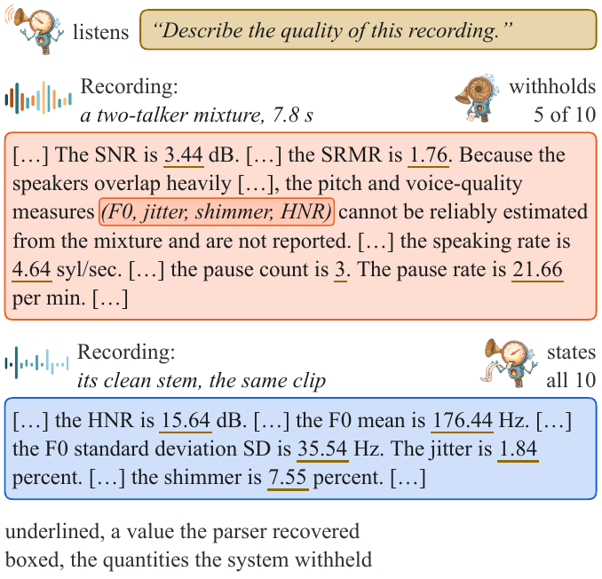

# AcoustiClaim: A Numeric Claim Benchmark with Instrument Ground Truth

AcoustiClaim extracts each numeric claim from an audio language model's free text, scores it against
the instrument that defines the quantity, and classes each quantity by where its reference can be
read, in the signal the model hears, in a mixing parameter, on a clean stem the model never hears, or
on the mixture outside the detected overlap. Ten quantities are scored, `srmr`, `snr`,
`speaking_rate`, `pause_count`, `pause_rate`, `f0_mean`, `f0_sd`, `jitter`, `shimmer` and `hnr`, on
Libri2Mix two-talker mixtures and on AMI distant-microphone meetings.



## Contents

- [Installation](#installation)
- [Data](#data)
- [Usage](#usage)
- [Results](#results)
- [License](#license)
- [Citation](#citation)

## Installation

Python 3.10 or later.

```bash
pip install -r requirements.txt
python -m pytest
```

The scoring path needs numpy and scipy alone. Generating new text needs the optional extras, torch,
transformers and the model packages.

```bash
pip install -r requirements-elicit.txt
```

## Data

`data/references/` holds the per-clip reference values every system is scored against, one file per
corpus. `data/manifests/` holds the Libri2Mix test mixing manifest, which names the source
utterances, the mixing parameters and the injected noise level of each mixture, and the two panel
clip lists, the 839 Libri2Mix mixtures and the 859 AMI clips the panel is scored on. Each Libri2Mix
mixture is scored beside its clean twin. `prompts/` holds the five elicitation prompts, a free
description, a request for numbers, the quantities named with units, a template and a worked
example. `outputs/` holds the generated text this repository scores, the five panel systems on both
corpora at every rung, and the reference decoder on the mixtures and their twins.

No audio is redistributed. Build the mixtures with [LibriMix](https://github.com/JorisCos/LibriMix)
over [LibriSpeech](https://www.openslr.org/12), and obtain the meetings from the
[AMI corpus](https://groups.inf.ed.ac.uk/ami/corpus/). The elicitation scripts read clips from
`data/audio/<corpus>` unless `--audio-dir` names another directory.

## Usage

Parse a description into claims.

```bash
python -m acousticlaim --text "The SNR is 3.4 dB, the speaking rate is 4.6 syllables per second and the HNR is 15.6 dB."
```

The parser reads 13 quantity names and their units out of prose. Ten of them are scored. Pass
`--external` for text whose phrasing is not the reference decoder's own.

Score the panel outputs.

```bash
python scripts/score_panel.py
```

A cell is one system stating one quantity at one elicitation rung on one corpus over at least 25
parsed claims. The panel is 207 cells. 158 of them carry a rank correlation, 49 emit fewer than five
distinct values, and 8 exceed the rank correlation bar of 0.3.

Score the reference decoder, the source of Table 1. The table reads the mixtures, except on the five
voice rows, which are read on the clips' clean twins.

```bash
python scripts/score_decoder.py --split mixtures
python scripts/score_decoder.py --split twins
```

Table 2's reference row is the same decoder on the panel clips of each corpus.

```bash
python scripts/score_decoder.py --outputs "outputs/decoder/librimix_panel839_seed*.json" \
    --out results/decoder_panel_librimix.json
python scripts/score_decoder.py --outputs "outputs/decoder/ami_panel859_seed*.json" \
    --corpus ami --reference data/references/ami_test.csv --out results/decoder_panel_ami.json
```

Every script takes its input and output paths as arguments and defaults to the folders in this
repository.

Generating new text is optional. `scripts/elicit.py` runs the open-weight systems and
`scripts/elicit_gemini.py` the closed model, which reads its API key from the `GEMINI_API_KEY`
environment variable.

## Results

`results/` holds the scored panel and the scored decoder output, one file per scorer run.

```bash
python scripts/make_tables.py
```

prints the paper's two tables from them, as text and as LaTeX rows. Table 1's ridge columns and
Fig. 3 come from the reference decoder's internal predictions, which are not part of this release.

## License

MIT, see [LICENSE](LICENSE).

## Citation

```bibtex
@inproceedings{lin2027acousticlaim,
  title     = {AcoustiClaim: A Numeric Claim Benchmark with Instrument Ground Truth},
  author    = {Lin, Sheng-Tse and Zhai, Siyuan and Kuo, Chien-Liang and Baali, Massa and Raj, Bhiksha},
  booktitle = {IEEE International Conference on Acoustics, Speech and Signal Processing (ICASSP)},
  year      = {2027},
  note      = {under review}
}
```
