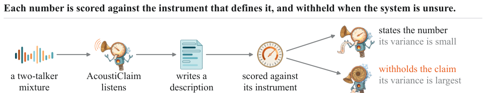
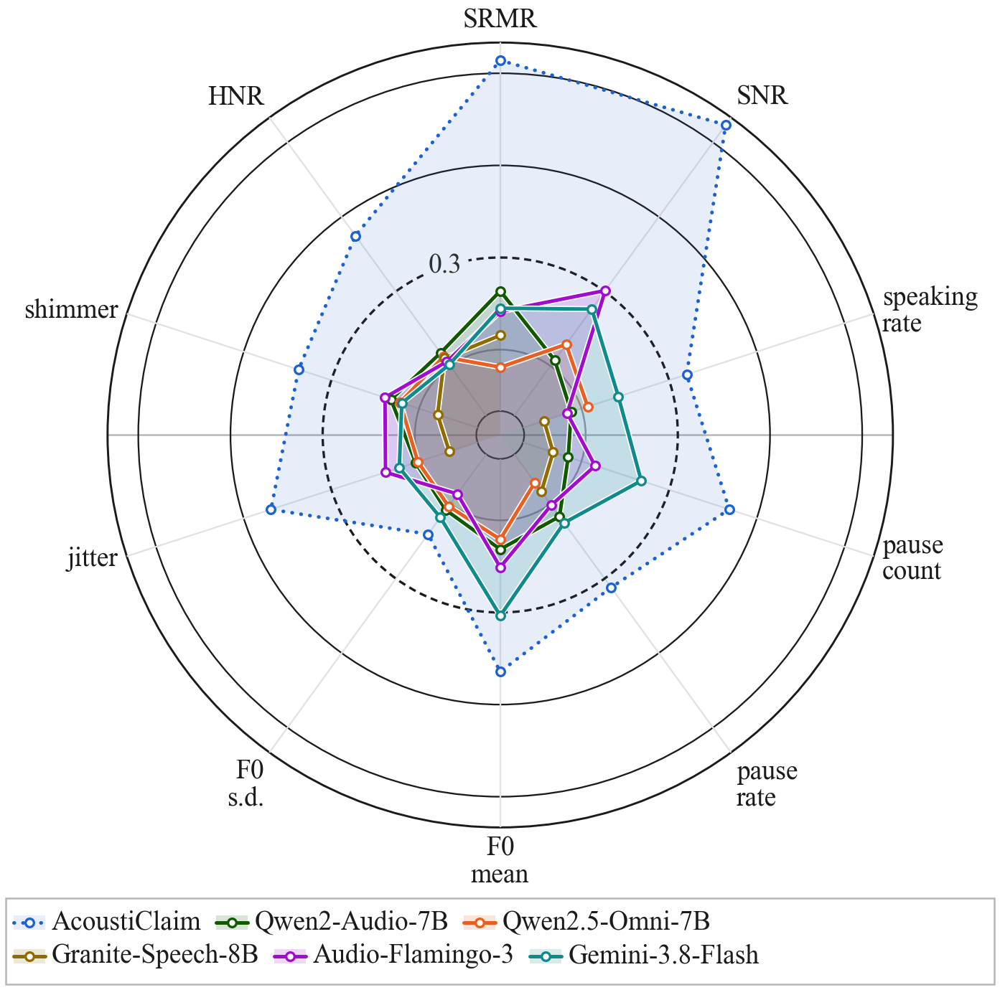

<div align="center">


**AcoustiClaim: A Numeric Claim Benchmark with Instrument Ground Truth**

<a href="LICENSE"></a>
<a href="requirements.txt"></a>

</div>

## Introduction

AcoustiClaim asks an audio language model to describe a recording, extracts every numeric claim from
the text it writes, and scores each claim against the instrument that defines the quantity. Ten
quantities are scored, `srmr`, `snr`, `speaking_rate`, `pause_count`, `pause_rate`, `f0_mean`,
`f0_sd`, `jitter`, `shimmer` and `hnr`, on Libri2Mix two-talker mixtures and on AMI
distant-microphone meetings. Each quantity is classed by where its reference can be read, in the
signal the model hears, in a mixing parameter, on a clean stem the model never hears, or on the
mixture outside the detected overlap, so a score always says which instrument it was taken against.

<div align="center">

</div>

The release holds three things.

- **The parser and the scorer.** `acousticlaim` reads the quantities and their units out of prose,
  takes a value only where its quantity is named with its unit and rescales nothing, and scores a
  cell by Spearman rank correlation and by absolute error normalised to the in-cell median, with a
  rankability rule of at least 25 claims and five distinct values.
- **The panel.** Five audio language models, Qwen2-Audio-7B, Qwen2.5-Omni-7B, Granite-Speech-8B,
  Audio-Flamingo-3 and Gemini-3.8-Flash, each prompted five ways on 839 Libri2Mix mixtures and 859
  AMI clips. The panel is 207 cells. 158 of them carry a rank correlation, 49 emit fewer than five
  distinct values, and 8 exceed the rank correlation bar of 0.3.
- **A reference decoder's outputs.** A frozen speech encoder feeding an instruction-tuned language
  model, with an auxiliary head that withholds a quantity on a clip when its own variance is largest.
  Its generated text is scored by the same parser and scorer. The model is not part of this release.

<div align="center">

</div>

Spearman rank correlation per quantity on the 839 Libri2Mix panel clips, the best prompt per cell,
the inner ring at −0.2 and the rim at 1.0. The dashed ring is the reporting bar of 0.3. A polygon
that breaks at an axis has no rank correlation there, never a zero. Two external cells clear the
bar on this corpus, Audio-Flamingo-3 on `snr` and Gemini-3.8-Flash on `f0_mean`. The reference
decoder states the five voice quantities on 6% of these clips and withholds them on the rest, so
those five vertices are read over the stated clips. `scripts/score_panel.py` and
`scripts/score_decoder.py` print every value on the wheel.

## Contents

- [Data](#data)
- [Install](#install)
- [Usage](#usage)
- [Results](#results)
- [License](#license)
- [Citation](#citation)

## Data

`data/references/` holds the per-clip reference values every system is scored against, one file per
corpus. `data/manifests/` holds the Libri2Mix test mixing manifest, which names the source
utterances, the mixing parameters and the injected noise level of each mixture, and the two panel
clip lists, the 839 Libri2Mix mixtures and the 859 AMI clips the panel is scored on. Each Libri2Mix
mixture is scored beside its clean twin. `prompts/` holds the five elicitation prompts, a free
description, a request for numbers, the quantities named with units, a template and a worked
example. `outputs/` holds the generated text this repository scores, the five panel systems on both
corpora at every prompt, and the reference decoder on the mixtures and their twins.

No audio is redistributed. Build the mixtures with [LibriMix](https://github.com/JorisCos/LibriMix)
over [LibriSpeech](https://www.openslr.org/12), and obtain the meetings from the
[AMI corpus](https://groups.inf.ed.ac.uk/ami/corpus/). The elicitation scripts read clips from
`data/audio/<corpus>` unless `--audio-dir` names another directory.

## Install

Python 3.10 or later.

```bash
pip install -r requirements.txt
python -m pytest
```

The scoring path needs numpy and scipy alone. Generating new text needs the optional extras, torch,
transformers and the model packages.

```bash
pip install -r requirements-elicit.txt
```

## Usage

### Parse a description

```bash
python -m acousticlaim --text "The SNR is 3.4 dB, the speaking rate is 4.6 syllables per second and the HNR is 15.6 dB."
```

The parser reads 13 quantity names and their units out of prose. Ten of them are scored. Pass
`--external` for text whose phrasing is not the reference decoder's own.

### Score the panel

```bash
python scripts/score_panel.py
```

A cell is one system stating one quantity at one prompt on one corpus over at least 25 parsed
claims. The scorer writes one file per corpus to `results/`.

### Score the reference decoder

The decoder's Table 1 reads the mixtures, except on the five voice quantities, which are read on
the clips' clean twins.

```bash
python scripts/score_decoder.py --split mixtures
python scripts/score_decoder.py --split twins
```

Its Table 2 row is the same decoder on the panel clips of each corpus.

```bash
python scripts/score_decoder.py --outputs "outputs/decoder/librimix_panel839_seed*.json" \
    --out results/decoder_panel_librimix.json
python scripts/score_decoder.py --outputs "outputs/decoder/ami_panel859_seed*.json" \
    --corpus ami --reference data/references/ami_test.csv --out results/decoder_panel_ami.json
```

Every script takes its input and output paths as arguments and defaults to the folders in this
repository.

### Generate new text

Generating text is optional, since `outputs/` already holds every file the scorers read.
`scripts/elicit.py` runs the open-weight systems and `scripts/elicit_gemini.py` the closed model,
which reads its API key from the `GEMINI_API_KEY` environment variable.

## Results

`results/` holds the scored panel and the scored decoder output, one file per scorer run.

```bash
python scripts/make_tables.py
```

prints the paper's two tables from them, as text and as LaTeX rows. Table 1's ridge columns and
Fig. 3 come from the reference decoder's internal predictions, which are not part of this release.

## License

MIT, see [LICENSE](LICENSE). The two images in `assets/` that carry the meter character are
BioRender content and are not covered by it, see [NOTICE](NOTICE).

Figure credits: `assets/logo.png` and `assets/pipeline.png`. Created in BioRender. Lin, S. (2026).

## Citation

```bibtex
@inproceedings{lin2027acousticlaim,
  title     = {AcoustiClaim: A Numeric Claim Benchmark with Instrument Ground Truth},
  author    = {Lin, Sheng-Tse and Zhai, Siyuan and Kuo, Chien-Liang and Baali, Massa and Raj, Bhiksha},
  booktitle = {IEEE International Conference on Acoustics, Speech and Signal Processing (ICASSP)},
  year      = {2027},
  note      = {under review}
}
```
